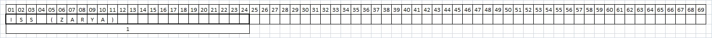

卫星星历的结构为三行，首行数据为卫星名称；后面两行则存储了卫星相关数据，每行69个字符，包括0～9、A～Z(大写)、空格、点和正负号。下面的示例及相关介绍参考[维基百科](https://en.wikipedia.org/wiki/Two-line_element_set)。

示例：

ISS (ZARYA)
1 25544U 98067A   08264.51782528 -.00002182  00000-0 -11606-4 0  2927
2 25544  51.6416 247.4627 0006703 130.5360 325.0288 15.72125391563537

## 首行，标题行（卫星名称）

## 第一行

| 字段 | 列     | 描述内容                                                                    | 示例           |
|----|-------|-------------------------------------------------------------------------|--------------|
| 1  | 01–01 | 行号                                                                      | 1            |
| 2  | 03–07 | 卫星编号                                                                    | 25544        |
| 3  | 08–08 | 卫星类别（U表示不保密，可供公众使用的；C 表示保密，仅限NORAD使用；S表示保密的，仅限NORAD使用）                  | U            |
| 4  | 10–11 | 卫星发射年份后两位                                                               | 98           |
| 5  | 12–14 | 当年发射顺序（例如：右侧表示卫星1998年第67次发射）                                            | 067          |
| 6  | 15–17 | 发射卫星个数（A表示是第一个，如果一次发射多颗卫星，使用26个英文字母排序；如果超过了26个编号，则使用两位字母，如AA、AB、AC编号）   | A            |
| 7  | 19–20 | TLE历时（年份后两位），                                                           | 08           |
| 8  | 21–32 | TLE历时 (用十进制小数表示一年中的第几日和日中的小数部分)                                         | 264.51782528 |
| 9  | 34–43 | 平均运动的一阶时间导数，用来计算每一天平均运动的变化带来的轨道漂移，提供给轨道计算软件预测卫星的位置。两行式轨道数据使用这个数据校准卫星的位置 | −.00002182   |

## 第二行

| 字段 | 列     | 描述内容                                                                                 | 示例          |
|----|-------|--------------------------------------------------------------------------------------|-------------|
| 1  | 01–01 | 行号                                                                                   | 2           |
| 2  | 03–07 | 卫星编号                                                                                 | 25544       |
| 3  | 09–16 | 轨道的交角是指天体的轨道面和地球赤道面之间的夹度，用0～90°来表示顺行轨道（从地球北极上空看是逆时针运行）；用90～180°表示逆行轨道（从地球北极上空看是顺时针运行 | 51.6416     |
| 4  | 18–25 | 升交点赤经，升交点赤经是指卫星由南到北穿过地球赤道平面时，与地球赤道平面的交点                                              | 247.4627    |
| 5  | 27–33 | 轨道偏心率，轨道离心率是指卫星椭圆轨道的中心点到地球的球心点的距离（c）除以卫星轨道半长轴(a)得到的一个0（圆型）到1（抛物线）之间的小数值              | 0006703     |
| 6  | 35–42 | 近地点幅角                                                                                | 130.5360    |
| 7  | 44–51 | 平近点角                                                                                 | 325.0288    |
| 8  | 53–63 | 每天环绕地球的圈数                                                                            | 15.72125391 |
| 9  | 64–68 | 发射以来飞行的圈数                                                                            | 56353       |
