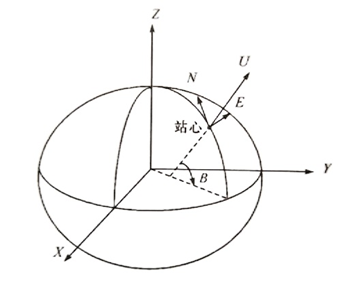
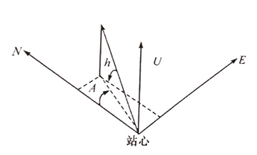

# Table of Contents
- [Table of Contents](#table-of-contents)
- [计算卫星高度角、方位角（XYZ转ENU，ENU转RAH）](#计算卫星高度角方位角xyz转enuenu转rah)
  - [公式原理](#公式原理)
- [程序设计（C语言）](#程序设计c语言)
  - [xyz转blh](#xyz转blh)
  - [xyz转enu](#xyz转enu)
  - [求卫星方位角、高度角](#求卫星方位角高度角)
- [坐标系相互转换（ecef2pos，pos2ecef，ecef2enu，enu2ecef）](#坐标系相互转换ecef2pospos2ecefecef2enuenu2ecef)
  - [宏定义与工具函数](#宏定义与工具函数)
    - [宏定义](#宏定义)
    - [工具函数](#工具函数)
  - [地固坐标系（xyz）→ 地理坐标系（BLH）](#地固坐标系xyz-地理坐标系blh)
    - [基础公式原理](#基础公式原理)


# 计算卫星高度角、方位角（XYZ转ENU，ENU转RAH）

主要步骤： 

1. 欧拉角旋转的方法将卫星的xyz坐标转换为站心坐标系的enu坐标（求解ENU需要BLH）
2. 然后通过高度角和方位角公式计算卫星在站心坐标系中的高度角和方位角。

## 公式原理

> 站心坐标系也称NEU坐标系或东北高坐标系，在地球上任一点观测卫星时，最直观和最方便的办法是知道卫星所在的瞬时位置的方位和仰角。因此，需将卫星的地固坐标系转化成站心坐标系。 

站心直角坐标系是以测站为坐标原点的左手坐标系，其N轴指向过该测站的子午线，北向为正；U轴重合与该点上WGS84椭球法线，向外为正；E轴位于该点的切平面，东向为正，如下图所示： 



站心坐标系常用极坐标表示（方位角A、高度角h、向径r），如下图所示：



建立以已知测站点$(X_r,Y_r,Z_r)$为原点的站心直角坐标系，则卫星在该坐标系的坐标$XL(E、N、U)$为：
$$X_L=R(X_s-X_r)$$
式中：$X_s$为卫星在地固系中的坐标向量；$X_r$为测站在地固坐标系中的坐标向量；$X_L$为卫星在站心坐标系中的坐标向量；$R$为旋转矩阵，即： 

$$
\begin{aligned}
&R=R_x(90-B) \cdot R_z(L+90)\\
&R=\left[\begin{array}{ccc}
1 & 0 & 0 \\
0 & \cos (90-B) & \sin (90-B) \\
0 & -\sin (90-B) & \cos (90-B)
\end{array}\right] \cdot\left[\begin{array}{ccc}
\cos (L+90) & \sin (L+90) & 0 \\
-\sin (L+90) & \cos (L+90) & 0 \\
0 & 0 & 1
\end{array}\right]\\
&R=\left[\begin{array}{ccc}
-\sin L & \cos L & 0 \\
-\sin B \cos L & -\sin B \sin L & \cos B \\
\cos B \cos L & \cos B \sin L & \sin B
\end{array}\right]
\end{aligned}
$$

**式中：B,L为测站的大地维度和大地精度。**

卫星从站心直角坐标系转换到站心极坐标系的公式为：
$$
\left\{\begin{array}{l}
r=\sqrt{E^2+N^2+U^2} \\
A=\arctan \frac{E}{N} \\
h=\arctan \frac{U}{\sqrt{E^2+U^2}}
\end{array}\right.
$$
式中：r为卫星向径，A为卫星方位角，h为卫星的高度角。


# 程序设计（C语言）

> 整体流程为：  
> 1）通过测站XYZ求出其经纬度  
> 2）通过测站经维度与测站和卫星的三维坐标差，求出卫星以测站为原点的ENU坐标  
> 3）通过ENU，计算卫星的方位角与高度角  
> 下面代码，XYZ单位均为米，角度单位均为弧度制，Xr，Yr，Zr表示参考点（测站）的三维坐标，Xs，Ys，Zs表示卫星的三维坐标。

结构体定义：

```cpp
#include <stdio.h>
#include <math.h>
typedef struct BLH
{
	double B;
	double L;
	double H;
} BLH, *pBLH;
 
typedef struct ENU
{
	double E;
	double N;
	double U;
} ENU, *pENU;
 
typedef struct RAH
{
    double R;
    double A;
    double H;
} RAH, *pRHA;
```

## xyz转blh

```cpp
BLH xyz2blh(double X, double Y, double Z)
{
	double a,f,e2,B = 0.0, N = 0.0, H = 0.0, R0, R1, deltaH, deltaB;;
	a=6378137.0,f=(1.0 / 298.257223563),e2=f*(2-f);
	BLH res = { 0 };
	R0 = sqrt(pow(X, 2) + pow(Y, 2));
	R1 = sqrt(pow(X, 2) + pow(Y, 2) + pow(Z, 2));
	//经度直接求解
	res.L = atan2(Y, X);
	//迭代求大地维度和大地高
	N = a;
	H = R1 - a;
	B = atan2(Z * (N + H), R0 * (N * (1 - e2) + H));
	do
	{
		deltaH = N;//判断收敛所用
		deltaB = B;
		N = a / sqrt(1 - e2 * pow(sin(B), 2));
		H = R0 / cos(B) - N;
		B = atan2(Z * (N + H), R0 * (N * (1 - e2) + H));
	} while (fabs(deltaH - H) > 1.0e-3 && fabs(deltaB - B) > 1.0e-9);
	res.B = B;
	res.H = H;
	return res;
}
```

## xyz转enu

```cpp
ENU xyz2enun(double Xr, double Yr, double Zr, double Xs, double Ys, double Zs)
{
    ENU enu = { 0 };
    BLH ref = xyz2blh(Xr, Yr, Zr);
    double sinL = sin(ref.L);
    double cosL = cos(ref.L);
    double sinB = sin(ref.B);
    double cosB = cos(ref.B);
    double dx = Xs - Xr;
    double dy = Ys - Yr;
    double dz = Zs - Zr;
    enu.E = -sinL*dx + cosL*dy;
    enu.N = -sinB*cosL*dx - sinB*sinL*dy + cosB*dz;
    enu.U = cosB*cosL*dx + cosB*sinL*dy + sinB*dz;
    return enu;
}
```

## 求卫星方位角、高度角 

```cpp
RAH Satrah(double Xr, double Yr, double Zr, double Xs, double Ys, double Zs)
{
    int i;
    RAH rah = {0};
    ENU enu = xyz2enu2(Xr, Yr, Zr, Xs, Ys, Zs);
    rah.H = atan2(enu.U, sqrt(enu.E * enu.E + enu.N * enu.N));
    rah.A = atan2(enu.E, enu.N);
    if (rah.A < 0)
        rah.A += 2 * PI;
    if (rah.A > 2 * PI)
        rah.A -= 2 * PI;
    rah.R = sqrt(enu.E * enu.E + enu.N * enu.N + enu.U * enu.U);
    return rah;
}
```
1. atan2为四象限反正切函数（atan，atan2并不相同），三角函数单位均为弧度  
2. 方位角A范围在0~360°；若A＜0，A=A+2pi；若A＞2pi，A=A-2pi  
3. atan2的范围为-90°～90°，高度角的范围在0～90°，RTKLIB中保留了高度角的符号，因此无需对高度角再进行归化。
4. 本次演示代码为使逻辑更加清晰，采取传入形参，以结构体作为返回值，也可以直接传入指针，通过指针修改更加便捷。
5. 计算BLH时，大地高未加入地球曲率改正，若对大地高有精度要求，请移步至RTKLIB函数专栏


# 坐标系相互转换（ecef2pos，pos2ecef，ecef2enu，enu2ecef）

RTKLIB库里的算法

## 宏定义与工具函数
### 宏定义

```cpp
#define PI 3.141592653589793
#define RE_WGS84    6378137.0           /* earth semimajor axis (WGS84) (m) */
#define FE_WGS84    (1.0/298.257223563) /* earth flattening (WGS84) */
```
上述定义分别对应：圆周率PI，WGS84椭球长半轴，WGS84椭球扁率。

### 工具函数

**dot函数函数**

> 参数声明：  
> - 向量a,向量b，维数n  
> 意义：  
> - 求向量a和向量b的点积，将结果存储到c中作为返回值返回，其中n为维数。

```cpp
/* inner product ---------------------------------------------------------------
 * inner product of vectors
 * args   : double *a,*b     I   vector a,b (n x 1)
 *          int    n         I   size of vector a,b
 * return : a'*b
 *-----------------------------------------------------------------------------*/
extern double dot(const double *a, const double *b, int n)
{
    double c=0.0;
    
    while (--n>=0) c+=a[n]*b[n];
    return c;
}
```

**matmul矩阵乘法函数**


> 参数声明：  
> - tr：转置标志，n：左矩阵行，k：左矩阵列或右矩阵的行，m：右矩阵的列  
> - A：左矩阵，B：右矩阵，C：原矩阵/结果矩阵  
> - alpha：乘法结果缩放因子，beta：原矩阵缩放因子  
> 
> 意义：  
> - 求得两矩阵的积，并且对其结果进行缩放。更详细的介绍请移步:RTKLIB——matmul(矩阵乘法函数)

```cpp
extern void matmul(const char *tr, int n, int k, int m, double alpha,
				   const double *A, const double *B, double beta, double *C)
{
	double d;
	int i, j, x, f = tr[0] == 'N' ? (tr[1] == 'N' ? 1 : 2) : (tr[1] == 'N' ? 3 : 4);

	for (i = 0; i < n; i++)
	{
		for (j = 0; j < k; j++)
		{
			d = 0.0;
			switch (f)
			{
			case 1:
				for (x = 0; x < m; x++)
				{
					d += A[i + x * n] * B[x + j * m];
				}
				break;
			case 2:
				for (x = 0; x < m; x++)
				{
					d += A[i + x * n] * B[j + x * k];
				}
				break;
			case 3:
				for (x = 0; x < m; x++)
				{
					d += A[x + i * m] * B[x + j * m];
				}
				break;
			case 4:
				for (x = 0; x < m; x++)
				{
					d += A[x + i * m] * B[j + x * k];
				}
				break;
			}
			if (beta == 0.0)
				C[i + j * n] = alpha * d;
			else
				C[i + j * n] = alpha * d + beta * C[i + j * n];
		}
	}
}
```

## 地固坐标系（xyz）→ 地理坐标系（BLH）

### 基础公式原理

**经度直接求解：**

$$tanL=\frac{E}{N}$$

在代码计算中，RTKLIB使用了`atan2`函数，将数值范围归化到-90度～90之间。因为分母不能为0，因此在计算前还需要判断坐标的合理性，于是上述公式转换成如下形式：

$$
L=
\begin{cases}
\begin{cases}\arctan \frac{y}{x} & x>0 \\ \arctan \frac{y}{x}+\pi & x<0, y \geq 0 \\ \arctan \frac{y}{x}-\pi & x<0, y<0 \quad x \neq 0, y \neq 0 \\ \frac{\pi}{2} & x=0, y>0 \\ -\frac{\pi}{2} & x=0, y<0\end{cases}
\\0 & x=0, y=0
\end{cases}
$$


使用`atan2`计算时，该函数会自动根据x,y的正负进行判断，因此写程序时只需要对x=0,y=0的情况进行额外判断即可。

**纬度与大地高迭代求解：**

其中，`e`表示WGS84椭球体的偏心率；`v`表示地球表面上的纬度对应的曲率半径；`B`表示计算得到的大地纬度，h表示计算得到的大地高。不难看出，大地维度是关于自身的函数，求解大地高需要v，而v随着维度而变化。因此需要进行迭代计算，在计算初，需要初始化：

$$
\begin{aligned}
& r=x^2+y^2 \\
& \sin B=\frac{z}{\sqrt{r^2+z^2}} \\
& v=\frac{a}{\sqrt{1-e^2 \sin ^2 B}} \\
& z=r \sin B+e^2 v \sin B \\
&
\end{aligned}
$$
https://wangjiujiu.blog.csdn.net/article/details/130051023?spm=1001.2014.3001.5502

https://blog.csdn.net/why1472587/article/details/130049801?spm=1001.2014.3001.5501

https://wangjiujiu.blog.csdn.net/article/details/130049801?spm=1001.2014.3001.5502

https://blog.csdn.net/mr_xiao0912/article/details/103106265