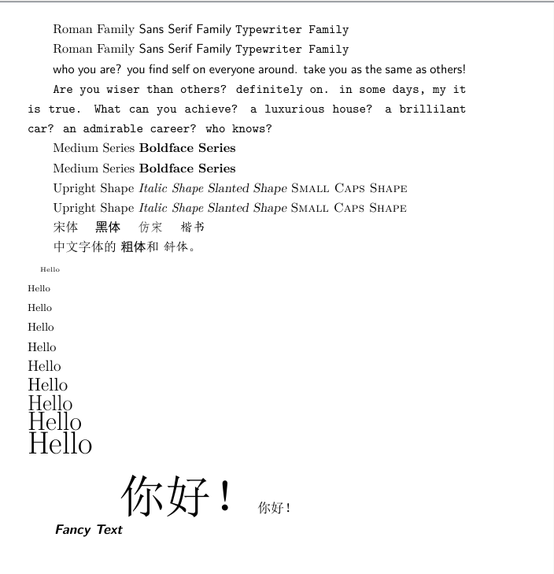

latex常用指令
# Table of Contents
- [Table of Contents](#table-of-contents)
- [常用碎片指令](#常用碎片指令)
  - [中文支持](#中文支持)
  - [无序列表](#无序列表)
  - [有序列表](#有序列表)
  - [加粗](#加粗)
  - [附录](#附录)
  - [代码段](#代码段)
  - [行间代码](#行间代码)
  - [行间公式](#行间公式)
  - [字体字号设置](#字体字号设置)
- [elegent主题](#elegent主题)
- [nuaa主题内容](#nuaa主题内容)

# 常用碎片指令
## 中文支持

`\usepackage{CJK}% 新增`

```latex
\begin{CJK*}{UTF8}{gkai}楷体测试\end{CJK*}

\begin{CJK*}{UTF8}{gbsn}宋体测试\end{CJK*}
```

## 无序列表
```latex
\begin{itemize}
    \item \ff{landscape}
          makes the document in ...
    \item \ff{slides}
          makes all hea...
    \item \ff{nocover}
          avoid printing the cover images on the first page by the \ff{\char`\\PrintFirstPage} command.
    \item \ff{anonymous}
          removes the name o...
    \item \ff{nobrand}
          avoid mentioning the name of n...
\end{itemize}
```

## 有序列表
```latex
\begin{enumerate}
  \item Win10 + \TeX{} Live 2022；
  \item Ubuntu 20.04 + \TeX{} Live 2022；
  \item macOS Monterey + Mac\TeX{} 2022。
\end{enumerate}
```
## 加粗  
`\textbf{求和算子}`

## 附录  
`\appendix`指令后添加`\chapter{附录}`即可

## 代码段  
```latex
\lstset{
      basicstyle=\linespread{1.0}\ttfamily\small,
      keywordstyle=\bfseries, % 设置关键字风格
      commentstyle=\itshape\color{gray}, % 设置注释风格
      stringstyle=\color{darkgray}, % 设置字符串风格
      breaklines=true,
      showstringspaces=false, % 不特别显示字符串中的空格
      numbers=left,
      numberstyle=\tiny\color{gray}, % 设置行号风格
      numbersep=2em,
      columns=flexible,
      frame=single,
      framesep=0.5em,
      postbreak=\raisebox{0ex}[0ex][0ex]{\ensuremath{\color{red}\hookrightarrow\space}}, % 自动换行后的标记
}

\begin{lstlisting}[language=C++]
#include <thread>
#include <mutex>
#include <iostream>
// test comment

int main() {
  std::cout << "main: " << g_i << '\n';
}

\end{lstlisting}


```
## 行间代码
```latex
\texttt{printf("Hello, world!");}
```

## 行间公式  
```latex
\begin{equation}
\sum_{i=1}^n x_i \equiv x_1 + x_2 +\cdots + x_n
\end{equation}
```

## 字体字号设置
```latex
%导言区
\documentclass[10pt]{article} %确定normalsize大小，为可选参数，在中括号内，此为10磅，只有10，11，12磅三个选项。

\usepackage{ctex}

%自定义字体
\newcommand{\myfont}{\textit{\textbf{\textsf{Fancy Text}}}}

%文稿区
\begin{document}
    %字体族设置（罗马字体、无衬线字体、打印机字体）
    \textrm{Roman Family} \textsf{Sans Serif Family} \texttt{Typewriter Family}

    {\rmfamily Roman Family} {\sffamily Sans Serif Family} {\ttfamily Typewriter Family}

    {\sffamily who you are? you find self on everyone around. take you as the same as others!}

    {\ttfamily Are you wiser than others? definitely on. in some days, my it is true. What can you achieve? a luxurious house? a brillilant car? an admirable career? who knows?}

    %字体系列设置（粗细、宽度）
    \textmd{Medium Series} \textbf{Boldface Series}

    {\mdseries Medium Series} {\bfseries Boldface Series}

    %字体形状（直立、斜体、伪斜体、小型大写）
    \textup{Upright Shape} \textit{Italic Shape} \textsl{Slanted Shape} \textsc{Small Caps Shape}

    {\upshape Upright Shape} {\itshape Italic Shape} {\slshape Slanted Shape} {\scshape Small Caps Shape}

    %中文字体
    {\songti 宋体} \quad {\heiti 黑体} \quad {\fangsong 仿宋} \quad {\kaishu 楷书}

    中文字体的 \textbf{粗体} 和 \textit{斜体} 。

    %字体大小,根据normalsize的大小确定，normalsize 在文档类的参数决定
    {\tiny           Hello}\\
    {\scriptsize     Hello}\\
    {\footnotesize   Hello}\\
    {\small          Hello}\\
    {\normalsize      Hello}\\
    {\large          Hello}\\
    {\Large          Hello}\\
    {\LARGE          Hello}\\
    {\huge           Hello}\\
    {\Huge           Hello}\\

    %中文字号设置命令、
    \zihao{-0} 你好！
    \zihao{5} 你好！

    \myfont

\end{document}
```


# elegent主题

- 引言  
```latex
\begin{quotation}
  \textbf{\textcolor{red}{引言xxxx}}
\end{quotation}
```

- 修改历史  
```latex
\datechange{2018/12/06}{版本 3.00 正式发布}
\begin{change}
  \item 调整 \lstinline{ctex} 宏包。
  \item 说明文档增加更新内容。
\end{change}
```
- 提问的样式  
`\question{有没有办法章节用“第一章，第一节，（一）”这种？}`

- 目录层级
`\begin{document}后加`\setcounter{tocdepth}{2}`

# nuaa主题内容

- Layout 选项

\documentclass后面的方括号中提供了一些类选项，可以帮助您微调文档的布局:

- `landscape`使文档以横向格式显示，还将纸张大小更改为16x9英寸(默认页面大小为A4)，使其非常适合演示。
- `slides`使所有的标题都变大一点，假设文档处于横屏模式，并以幻灯片的形式呈现。
使用\PrintFirstPage命令避免打印第一页的覆盖图像。
- `nocover`避免使用`\PrintFirstPage`命令在第一页打印封面图像。
- `anonymous`删除作者的名字，包括页面底部，作者的名字留在公司名字旁边。
- `nobrand`在文件中避免提及南航的名字，并删除logo。
- `nosecurity`避免在文档的右下角提到安全级别，也避免在通常可见的地方显示作者的ID。
- `nodate`不会在每页底部显示日期和时间，在那里它们通常以ISO 8601格式呈现。
- `nopaging`避免每页底部的页码。
- `authordraft`在每页上打印一个大大的“这是草稿”的信息。
- `cn` 中文


- 序言

在序言中，你可以指定关于文档的元信息，比如它的标题或作者的名字，如下所示:
```latex
\documentclass{nankai}
\title{Making Compression Faster}
\subtitle{Technical Report}
\author{Zhenyu Zhong}
\begin{document}
\maketitle
Hello, world!
\end{document}
```
定义了以下meta命令:

- `\title`是要在文本和PDF文档属性中使用的文档的主标题。
- `\subtitle`是要在标题下打印的副标题。
- `\author`是““first-name last-name” 格式文档的作者。
- `\id`是作者的内部id，如果适用的话。
- `\company`是作者工作的公司/部门的名称。
- `\security`是指文件的安全级别，通常打印在文件的右上角;通常的值是“公开”，“内部”，“机密”或“秘密”。


- 自定义命令

在文档正文中，你可以使用这些命令。
- `PrintFirstPage{front-image}` 打印项目章程或类似横向文件的第一页。类似的景观文件的第一页，将图像front-image.pdf放在前面（该文件应该存在于当前目录下）。如果你没有前面的
图像文件，就把第一个参数留空。
- `PrintLastPage{}` 打印项目章程或类似地景文件的最后一页。
Scape文档的最后一页。
- `PrintThankYouPage{}` 打印最后一页，中间有一个 "谢谢 "的信息。
打印最后一页，中间有一条 "感谢 "信息。
- `PrintDisclaimer{}`打印页面底部的一段话，其中有一个标准的免责声明。
标准的免责声明。


- 自定义环境

定义了以下helper环境:
“\note”是一个带有彩色背景的文本框，可用于突出显示重要信息。这里有一个例子:

```latex
\begin{note}
    This is a note.
\end{note}
```

- 最佳实践

   - 两列   
在横屏格式中，建议使用两列，以提高文本的可读性。以下是如何做到的:  
```latex
\documentclass{nankai}
\begin{document}
\newpage
\begin{multicols}{2}
\section*{First}
Here goes the first column content.
\columnbreak
\section*{Second}
Here goes the second column content.
\end{multicols}
\end{document}
```

   - 面包屑  
当你需要在一个页面中放入许多小的信息片段时，我们建议你使用“碎屑”:  
```latex
\documentclass{nankai}
\begin{document}
\newpage
\section*{Project Details}
\begin{multicols}{2}
\raggedright
\PrintCrumb{Budget}{\$100K}

\PrintCrumb{Duration}{5 months}
\end{multicols}
\end{document}
```

